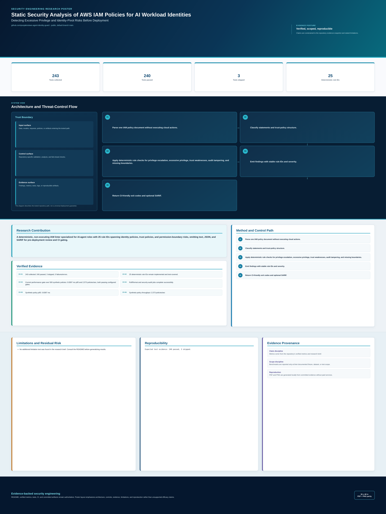

<!-- security-systems-poster -->
## Research Poster

**Security Systems / 02 — Static Security Analysis of AWS IAM Policies for AI Workload Identities**

[](poster/poster_36x48.pdf)

> Technical research poster (36 x 48 in). Click the image for the print-resolution **[PDF](poster/poster_36x48.pdf)**.
> Poster measurements are dated snapshots at their printed commits. Use the repository evidence files for newer results; do not read the poster as a verification of the latest `main`.
> Every metric on it is evidence-backed; historical/projected numbers are labeled and separated from current results.
<!-- security-systems-poster -->

# AWS Agent Identity Guard

> Static analysis for AWS IAM policies used by AI agents and tool executors — flag over-privileged, escalation-prone, and audit-tampering grants before deployment.

[](https://github.com/poojakira/aws-agent-identity-guard/actions/workflows/ci.yml)
[](VERIFIED_METRICS.md)
[](VERIFIED_METRICS.md)
[](LICENSE)

Maintainer: Pooja Kiran ([@poojakira](https://github.com/poojakira)).

Portfolio: [Pooja Kiran Security Engineering Portfolio](https://poojakira.github.io/Pooja_Kiran_Portfolio_Website/).

## Overview

`aws-agent-identity-guard` reads IAM policy JSON (identity, trust, and permission-boundary) and produces reviewable findings for the agent-specific risk patterns that turn overbroad cloud permissions into real actions — invoking Lambda, assuming roles, changing Bedrock/SageMaker control-plane resources, reading secrets, or disabling audit trails. It is a static linter: no AWS calls in default mode, zero runtime dependencies for local-file scanning, and an optional live account scan when installed with `boto3`.

## Verified Snapshot

Reproduced on current `main`; CI emits `PYTEST_EVIDENCE`. Evidence: [VERIFIED_METRICS.md](VERIFIED_METRICS.md).

| Metric | Current verified result |
|---|---:|
| Tests | 243 collected — 240 passed, 3 skipped (live-scan, need AWS creds) |
| Deterministic rules | 25 (AIG001–AIG021, AIG-TP001–003, AIG-PB001) |
| Output formats | text, JSON, SARIF 2.1.0 |
| Ruff / format | clean |

## Security Problem

AI agents and tool executors run under IAM roles. An over-permissive role lets an autonomous agent escalate privilege (`iam:PassRole` without conditions, policy-modification actions), widen blast radius (`Resource: "*"`), pivot across accounts (weak trust policies), or disable its own audit trail (`cloudtrail:StopLogging`). These risks are reviewable in the policy document *before* deployment — which is where this tool operates.

## Threat Model & Scope

**In scope:** static analysis of a single IAM policy document per invocation (identity/trust/permission-boundary), emitted as text/JSON/SARIF for pre-deploy review and CI gating.

**Out of scope / not claimed:** It does not call AWS in default mode, does not compute effective permissions, does not resolve ARNs or prove a role exists, and does not enforce at runtime. It complements — does not replace — IAM Access Analyzer, Prowler, Parliament, CloudTrail, and Security Hub. There is no fail-open/fail-closed runtime behavior because it is not a runtime gatekeeper. Condition-key checks verify presence, not logical sufficiency.

## Architecture

```text
IAM policy JSON  --->  argparse / json.loads (allow_pickle=False, dup-key reject)
      |
      v
scanner.py: scan_policy_document / scan_trust_policy   (25 deterministic rules)
      |
      v
Output: text / JSON / SARIF 2.1.0  --->  stdout or file
      |
      v
Exit code 0 (clean) / 1 (high|critical finding) / 2 (input/CLI error)   --->  CI gate

[--live-scan]  AWS IAM read-only APIs (boto3) ---> same rule engine
```

## Core Capabilities

- 25 deterministic rules: wildcard grants, `iam:PassRole`, `sts:AssumeRole`, privilege escalation, blast radius, trust-policy risks (wildcard principal, missing `ExternalId`/`SourceArn`), and missing permission boundaries
- Text, JSON, and SARIF 2.1.0 output; GitHub Code Scanning compatible
- CI merge-gate exit codes (0 / 1 / 2)
- Optional `--live-scan` mode (read-only IAM APIs) with a `max_roles` safety cap
- Deterministic remediation templates for a subset of rules


No AWS credentials required. No cloud calls. Just feed it your policy JSON.

## Install

```bash
pip install aws-agent-identity-guard
```

## Usage

```bash
aws-agent-identity-guard deploy/agent-role-policy.json
```

### Output

```
CRITICAL AIG002 statement=0: Wildcard service prefix 'bedrock:*' grants full Bedrock control
  remediation: Replace bedrock:* with specific actions: bedrock:InvokeModel, bedrock:InvokeModelWithResponseStream
CRITICAL AIG004 statement=0: iam:PassRole without iam:PassedToService condition
  remediation: Add Condition: {"StringEquals": {"iam:PassedToService": "bedrock.amazonaws.com"}}
CRITICAL AIG005 statement=0: Policy grants privilege-management action: iam:AttachRolePolicy
  remediation: Remove iam:AttachRolePolicy — agents must not modify their own permissions
CRITICAL AIG011 statement=0: Policy grants audit-tampering action: cloudtrail:StopLogging
  remediation: Remove cloudtrail:StopLogging — no agent should disable its audit trail
HIGH AIG003 statement=0: Resource '*' with 12 actions creates unbounded blast radius
  remediation: Scope Resource to specific ARNs for each action
HIGH AIG006 statement=0: lambda:InvokeFunction without function-name scoping
  remediation: Restrict Resource to arn:aws:lambda:REGION:ACCOUNT:function:FUNCTION_NAME
HIGH AIG009 statement=0: SageMaker control-plane action sagemaker:CreateEndpoint in agent role
  remediation: Remove sagemaker:CreateEndpoint or scope to specific endpoint configs
HIGH AIG010 statement=0: Network egress modification action ec2:CreateNetworkInterface
  remediation: Remove ec2:CreateNetworkInterface — agents should not modify network paths
HIGH AIG014 statement=0: s3:* includes write/delete without key-prefix scoping
  remediation: Scope to specific bucket and prefix: arn:aws:s3:::bucket/prefix/*
```

Exit code `1` means at least one high or critical finding was detected. Whether that blocks deployment is controlled by your CI policy.

### Output Formats

```bash
# Human-readable (default)
aws-agent-identity-guard policy.json

# JSON for programmatic consumption
aws-agent-identity-guard policy.json --format json

# SARIF for GitHub Advanced Security
aws-agent-identity-guard policy.json --format sarif --output results.sarif
```

## CI Integration

```yaml
- run: pip install aws-agent-identity-guard
- run: aws-agent-identity-guard deploy/agent-role-policy.json --format sarif --output results.sarif
- uses: github/codeql-action/upload-sarif@v3
  with:
    sarif_file: results.sarif
```

Findings can appear inline on pull requests through GitHub Code Scanning. Critical or high findings return exit code `1`, so a workflow can use the result as a merge gate.

Full workflow example:

```yaml
name: Agent IAM Lint
on: [pull_request]
jobs:
  lint:
    runs-on: ubuntu-latest
    permissions:
      security-events: write
    steps:
      - uses: actions/checkout@v4
      - uses: actions/setup-python@v5
        with:
          python-version: '3.12'
      - run: pip install aws-agent-identity-guard
      - run: aws-agent-identity-guard deploy/agent-role-policy.json --format sarif --output results.sarif
      - uses: github/codeql-action/upload-sarif@v3
        with:
          sarif_file: results.sarif
```

## What It Catches: 25 rules

24 rules run in static file-scan mode; AIG-PB001 additionally runs in `--live-scan` mode (it needs role metadata from the AWS API). All 25 rule IDs are emitted by the code and covered by tests.

| Rule | Severity | Pattern |
|------|----------|---------|
| AIG001 | HIGH / CRITICAL | NotAction/NotResource in agent policies (escalates to CRITICAL for `NotAction`+`Allow`, a wildcard-equivalent grant) |
| AIG002 | CRITICAL | Wildcard service prefix (`bedrock:*`, `s3:*`), including the `NotAction`+`Allow` complement |
| AIG003 | HIGH | `Resource: "*"` - unbounded blast radius |
| AIG004 | CRITICAL | `iam:PassRole` without `iam:PassedToService` condition (also evaluated on the `NotAction`+`Allow` complement) |
| AIG005 | CRITICAL | Privilege-management / escalation actions (iam:*, policy modification, `CreateAccessKey`, `Create`/`UpdateLoginProfile`, `Put`/`AttachGroupPolicy`) |
| AIG006 | HIGH | Tool execution (Lambda, SSM, ECS, Bedrock) without resource scoping |
| AIG007 | MEDIUM | Sensitive data access without ABAC tags |
| AIG008 | CRITICAL | Bedrock control-plane, agent can modify itself |
| AIG009 | HIGH | SageMaker control-plane in a runtime role |
| AIG010 | HIGH | Network egress modification (ENI, security groups) |
| AIG011 | CRITICAL | Audit trail tampering (CloudTrail, GuardDuty, Config) |
| AIG012 | MEDIUM | Excessive action breadth (>15 actions per statement) |
| AIG013 | MEDIUM | `Resource: "*"` with zero Condition keys |
| AIG014 | HIGH | S3 write/delete without key-prefix scoping |
| AIG015 | MEDIUM | Bedrock InvokeModel without model-ID scoping |
| AIG016 | HIGH | Lambda invoke without function-name scoping |
| AIG017 | HIGH | `sts:AssumeRole` without session tag requirements |
| AIG018 | HIGH | Database full-table access without row-level conditions |
| AIG019 | CRITICAL | Credential-access and identity-pivot actions in Allow statements; effective permissions require review |
| AIG020 | HIGH | Credential-access and instance-identity discovery actions; does not prove IMDS reachability |
| AIG021 | CRITICAL | All three action categories appear; does not prove an executable chain |
| AIG-TP001 | CRITICAL / HIGH | Wildcard principal (`*`); severity is lower when a Condition block exists because static analysis cannot prove its sufficiency |
| AIG-TP002 | MEDIUM | AWS-principal trust without `sts:ExternalId`; advisory for third-party/shared-service delegation, not a universal cross-account requirement |
| AIG-TP003 | MEDIUM | AWS service-principal trust without `aws:SourceArn` / `aws:SourceAccount` / `aws:SourceOrg*` scoping where supported |
| AIG-PB001 | MEDIUM | Role with critical findings but no permission boundary (emitted only in `--live-scan` mode, where role metadata is available) |

## Live Account Scanning

Scan roles in a running AWS account (requires `boto3`):

```bash
pip install 'aws-agent-identity-guard[live]'

# Scan all roles
aws-agent-identity-guard --live-scan --format json

# Scan a specific agent role
aws-agent-identity-guard --live-scan --role-name my-bedrock-agent-role

# SARIF output
aws-agent-identity-guard --live-scan --format sarif --output scan.sarif
```

## Relationship to Other IAM Tools

Use this alongside mature AWS security tools. It is intentionally narrower than account-wide posture products and focuses on pre-deploy policy review for agent roles.

| | aws-agent-identity-guard | Parliament | Prowler | IAM Access Analyzer |
|---|---|---|---|---|
| Main role | Agent-role static linter | General IAM linting | Account posture assessment | AWS policy analysis service |
| Default data path | Local policy JSON | Local policy JSON | AWS account/API scan | AWS service APIs |
| Agent-specific rules | Implemented in this repo | Out of scope for this audit | Out of scope for this audit | Out of scope for this audit |
| SARIF output | Implemented in this repo | Tool/version dependent | Workflow dependent | Export/integration dependent |
| Account-wide cloud context | No | No | Yes | Yes |

## Exit Codes

| Code | Meaning |
|------|---------|
| 0 | No critical or high findings found by these rules |
| 1 | Critical or high findings found |
| 2 | Invalid input or CLI error |

## Local Test Note

Some developer workstations load unrelated pytest plugins globally. To run this project's tests in an isolated way:

```bash
PYTEST_DISABLE_PLUGIN_AUTOLOAD=1 python -m pytest tests -q
```

## Known Limitations

- **Static analysis only.** This tool reads IAM policy JSON and produces findings. It does not intercept API calls, enforce runtime deny decisions, or act as a policy enforcement point. There is no "fail-closed" behavior because it is not a runtime system.
- **No semantic understanding of Condition keys.** The scanner checks for the *presence* of specific Condition keys (e.g., `iam:PassedToService`, `aws:SourceArn`) but does not evaluate whether the condition values are logically sufficient to mitigate a risk.
- **Single-policy scope.** Each invocation analyzes one policy document in isolation. Cross-policy interactions (e.g., a permissive identity policy constrained by an SCP or permission boundary) are not considered.
- **Trust-policy context is incomplete in static mode.** The scanner cannot infer whether an AWS principal is same-account, organization-owned, or a third party. `AIG-TP002` is therefore an advisory. `AIG-TP003` is limited to AWS service principals and only recommends source-scoping keys where that service supports them.
- **Action pattern matching is prefix-based.** Wildcard detection uses prefix/fnmatch logic. Unusual action name formats or future AWS service namespaces may not be covered until rules are updated.
- **No AWS API calls in default mode.** The tool cannot resolve resource ARNs, check whether a role actually exists, or determine effective permissions. Use IAM Access Analyzer or CloudTrail for runtime validation.
- **Trust policy analysis requires explicit invocation.** `scan_trust_policy()` must be called separately; it is not triggered by passing a standard identity policy to `scan_policy_document()`.
- **Large policies may produce many findings.** A policy with 200+ actions in a single statement will trigger multiple overlapping rules. Findings are not deduplicated across rules by design — each rule surfaces a distinct risk vector.

## Failure Semantics

This tool is a static linter. It reads a file, analyzes it, and exits. There is no persistent process, no daemon, no network listener, and no fail-open/fail-closed runtime behavior.

| Exit Code | Meaning | When It Happens |
|-----------|---------|-----------------|
| **0** | Clean scan | No critical or high-severity findings were detected. The policy may still have medium/low findings. |
| **1** | Findings detected | At least one critical or high-severity finding exists. In `--enforce` mode with `--live-scan`, also returned when the scan was incomplete or encountered errors. |
| **2** | Input/CLI error | The input file does not exist, is not valid JSON, is not a JSON object, cannot be decoded as UTF-8, or the CLI was invoked with invalid arguments. The tool prints a diagnostic message to stderr/stdout and exits immediately. |

**Design rationale:** Exit code 2 signals "the tool could not do its job" — the input was unusable. Exit code 1 signals "the tool did its job and found problems." CI pipelines should treat exit 2 as an infrastructure failure (fix the input), and exit 1 as a policy gate (fix the policy or accept the risk).

**No fail-closed behavior:** Because this is not a runtime gatekeeper, there is no concept of "fail closed." If the tool cannot parse the input, it exits 2 and produces no findings — it does not block or allow anything. Whether a CI pipeline treats exit 2 as a blocking failure is a pipeline-configuration decision, not a tool decision.

## Verification

| Field | Value |
|-------|-------|
| Environment | GitHub Actions `ubuntu-latest`; Python 3.11 evidence job (matrix also covers 3.10 and 3.12) |
| Historical main CI | 2026-09-23, 231 passed and 3 skipped |
| Current main CI | 243 collected: 240 passed, 3 skipped; confirmed at current HEAD `e77583a` |
| Test command | `python -m pytest tests/ -q` |
| Test result | See historical CI and current local results above; exact commands in `VERIFIED_METRICS.md` |
| Rule coverage | All 25 emitted rule IDs (AIG001–AIG021, AIG-TP001–TP003, AIG-PB001) are referenced by positive/negative tests; parser edge cases fuzzed in `tests/test_iam_parser_fuzz.py` (Hypothesis), failure modes in `tests/test_failure_modes.py` |
| SARIF | Output validated against SARIF 2.1.0 MUST-level invariants in `tests/test_cli_output.py` |
| Lint/format | `ruff==0.8.4 check src tests` and `ruff format --check src tests` clean |

To re-verify after changes:

```bash
PYTEST_DISABLE_PLUGIN_AUTOLOAD=1 python -m pytest tests/ -q
```


## Additional Documentation

- [INCIDENT_RUNBOOK.md](INCIDENT_RUNBOOK.md) - incident response for false positives and escalation patterns
- [docs/PERFORMANCE_BASELINE.md](docs/PERFORMANCE_BASELINE.md) - scan performance baselines and regression gates
- [benchmarks/perf_gate.py](benchmarks/perf_gate.py) - CI performance gate (p95 < 10ms, >1000 policies/sec)

## Companion demo: delegated short-lived credentials (mocked)

An additive, illustrative demo lives under [`examples/delegated_credentials/`](examples/delegated_credentials/README.md). It shows an agent exchanging an OIDC/workload-identity token for **short-lived, scoped credentials** via STS `AssumeRoleWithWebIdentity`, with `ExternalId`-based confused-deputy prevention.

This demo is **mocked with [moto](https://github.com/getmoto/moto) (`@mock_aws`) — it does not call live AWS.** It is illustrative only and does not change the fact that the core tool is a static IAM linter. Verified: 6 tests passed with moto 5.2.3 / boto3 1.43.103. See [`examples/delegated_credentials/README.md`](examples/delegated_credentials/README.md) for details.

## License

MIT — see [LICENSE](LICENSE).

<!-- repo-verification:start -->
## Verification update — 2026-09-30

- **Scope:** Account-wide `poojakira` repository pass covering source/configuration, CI/release workflows, security-hygiene gates, dependency/SAST controls, and documentation consistency.
- **Remediation:** Pinned release/container actions to immutable revisions and re-ran the repository gates.
- **Verification state:** CI, Production Gate, Security Hygiene, Documentation Integrity, and Container Release completed successfully after the hardening commits.
- **Security note:** IAM findings remain static-analysis evidence; no claim is made that analyzed policies were deployed to a live AWS account.
- **Evidence boundary:** This update records repository and GitHub Actions evidence observed during the pass. It is not a claim of independent penetration testing, production deployment, or zero residual risk.
<!-- repo-verification:end -->

## Verification checkpoint — 2026-09-30

- **Snapshot commit:** `43da7475d0b44877f387994743af2fa20590905b`
- **Status:** VERIFIED GREEN
- **Evidence:** Container Release, Documentation Integrity, repository checks, Production Gate, and CI completed successfully on the snapshot revision.
- This note records only the observed workflow state for this dated snapshot.


## Secret handling

Keep runtime credentials outside Git. If this repository provides an `.env.example` or `.env.sample`, copy it to a local `.env` or `.env.local` and fill in values locally; the real environment file must remain untracked.

Do not commit AWS access keys or session credentials, API tokens, service-account JSON, private keys, package-manager credentials, Terraform state, or secret-bearing `tfvars`. CI/deployment credentials belong in GitHub Actions secrets or the deployment provider's secret manager. AWS account IDs are identifiers; AWS access-key IDs, secret access keys, and session tokens are credentials.

If a real credential is ever exposed, revoke or rotate it at the provider first, then remove it from the working tree and reachable Git history. The Security Hygiene workflow checks the current tree and reachable history for common credential formats without printing matched secret values.

<!-- security-local-config:start -->
## Secrets and local configuration

- Never commit real API keys, access tokens, passwords, cloud credentials, private keys, or a populated `.env` file.
- Local `.env` and `.env.*` files are ignored by Git. Only safe templates such as `.env.example` or `.env.sample` may be committed, and they must contain placeholder or empty values only.
- If an integration needs credentials, create your own local `.env` file (or use your shell/secret manager) and supply **your own** API key. In GitHub Actions, use repository/environment secrets rather than hard-coding values in workflow YAML.
- Do not copy or reuse any credential that appears in repository history, examples, tests, screenshots, logs, or documentation. Test strings are not intended to be usable credentials.
- If a real credential is ever committed, **revoke or rotate it at the credential provider first**, then remove it from the current tree and reachable Git history. Deleting a key from GitHub does not revoke it.
<!-- security-local-config:end -->

## Product validation

This repository separates **implementation evidence**, **public/external interoperability checks**, and **real deployment or customer evidence**. See [PRODUCT_VALIDATION.md](PRODUCT_VALIDATION.md) for the current validation ladder, reproducible checks, and the claims that are deliberately out of scope. A passing test or public-data canary is not presented as customer adoption or universal production efficacy.


## Recruiting evidence audit (2026-10-09)

See [the bounded recruiting evidence audit](docs/RECRUITER_EVIDENCE_AUDIT_2026-10-09.md) for current dated verification, test-scope limitations and unsupported impact claims.
